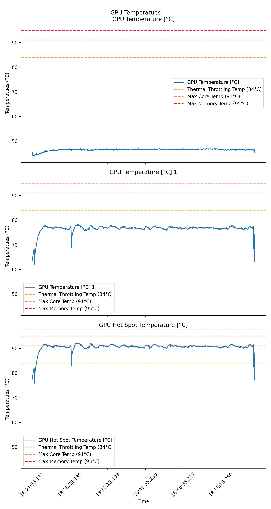

# gpu-health-check

<!--toc:start-->
- [gpu-health-check](#gpu-health-check)
  - [Description](#description)
  - [Procedure](#procedure)
    - [Physical Inspection](#physical-inspection)
    - [GPU Installation](#gpu-installation)
    - [Fan Health](#fan-health)
    - [Stability and Performance](#stability-and-performance)
      - [Memory](#memory)
      - [Core Stability](#core-stability)
      - [Performance](#performance)
      - [Holistic](#holistic)
  - [Usage](#usage)
<!--toc:end-->

## Description

The following is a checklist of tests, highly inspired by this [video](https://www.youtube.com/watch?v=oRMPp-8IGQw), which can be run in order to assess the health of a recently bought second hand GPU. These tests are relatively quick to perform and should let you assess the quality of the GPU before any return policy windows expire.

>[!WARNING]
> This guide is provided for informational purposes only. Given the significant investment GPUs represent, users should exercise their own judgment when making purchasing decisions. While these tests have worked for me personally when evaluating second-hand GPUs, I cannot guarantee their effectiveness in all situations and accept no responsibility for any purchasing decisions made based on this guide.
>
> While passing these tests is encouraging, it does not guarantee the GPU is completely fault-free. However, failing any test is a clear indication of hardware issues. These tests should be considered as a way to identify problems rather than as absolute proof of perfect functionality.

## Procedure

### Physical Inspection

The following are some things to look out for during a first physical inspection:

- A broken warranty seal - This means the previous owner has likely opened the card up at some point. Another telltale sign of this is if the thermal pads look "chunky", i.e., they have likely installed their own. This is not immediately a bad thing, but it does increase the likelihood that something is wrong with the card - why did they have to open it up? Did they break anything when they opened it up? etc.
- Liquid coming out of the fans - This implies the lubricant seal has broken. This is a very bad sign in terms of the health of the fans and is likely going to cause a mess when they turn on.
- Look to see if the heatsink is clogged with dust/obstructions. This can be an indication of how the card was looked after by the previous owner.
- Look to see if the card is rusting - This implies the card has been in a humid environment and it is likely this will have an adverse effect on the card's lifespan.

### GPU Installation

Immediately before installing your new GPU you should run [DDU](https://www.guru3d.com/download/display-driver-uninstaller-download/) on your system to remove any drivers that may exist on your system for your old GPU. After doing this you should shut your system down and install your new GPU. Finally, when you first log onto your system after having installed the GPU, be sure to install the latest version of your GPU drivers. Now is also a good time to open up a program like GPU-Z to check that your system is detected the expected card and that it's sensors are feeding.


### Fan Health

Fans are typically the first point of failure and as such it is the first thing we will check. The main thing we want to check is that the fan is able to maintain a set RPM for a prolonged period of time without any spikes, as this would be a sign the fan was dying. The test procedure for this is as follows:

- Use [HWiNFO64](https://www.hwinfo.com/download/) to log fan speeds.
- Use MSI afterburner to set a specific fan speed.
- Set the speed to 50% for 30 minutes and then 100% for another 30 minutes.

>[!TIP]
> Make sure your fans are synced if that is an option.

>[!WARNING]
> Often you will see a mismatch between the fans the software detects and the number of physical fans you see. Most commonly this occurs when there are 3 physical fans but only 2 fans detected. This is usually because multiple fans are connected to the same fan header via a hub.

Now with the logged fan data, you can use plotting software of your choice to analyze the data. You are looking for a relatively consistent curve for your set speeds, i.e., no spikes. For example, the plot below shows a stable fan curve for the above experiment.


### Stability and Performance

During stress testing, use HWiNFO64 to monitor three critical temperature readings:

1. GPU Core Temperature
   - Must stay under manufacturer's rated limit (e.g., 91°C for GTX 1080 Ti)
   - Should ideally stay below the throttling temperature for optimal performance (e.g., 84°C for GTX 1080 Ti)

2. GPU Hot Spot Temperature
   - Typically represents memory junction temperature
   - Must stay under VRAM specifications (e.g., 95°C for GDDR6X)
   - Can exceed core temperature limits while remaining safe

The plot below is an example of good thermal performance. All sensors stay below their limits and the GPU core temperature has significant thermal headroom relative to its throttling limit. It should also be noted that the plot below contains the integrated graphics chip's temperatures, i.e. the CPU, this is not important for the purposes of testing the GPU. 



>[!NOTE]
> High temperatures impact performance in two ways:
> - Thermal throttling reduces clock speeds
> - Reduced efficiency and potential longevity

>[!TIP]
> If you would like to use the plotting code in this repository you can enter your card's thermal thresholds inside the `src/config.py` file. You can find the core limits on the card manufacturer site and the memory limits from a micron spec sheet.

>[!WARNING]
> Immediately shut down if you observe:
> - Temperatures exceeding manufacturer limits
> - Continued temperature rise during throttling
> - Unusual temperature spikes
>
> These conditions may indicate failed safety systems and pose fire risks.

#### Memory

- Quick test - [GPUMemTest](https://www.programming4beginners.com/gpumemtest) to quickly check the card's memory. 
- Extensive test - The [OCCT](https://www.ocbase.com/) VRAM test. 

#### Core Stability

Run the [OCCT](https://www.ocbase.com/) 3D standard test with error detection.


>[!NOTE]
> It is normal to hear coil whine while performing this test; this is not a concern.

#### Performance

The previous tests are assessing hardware faults based on the existence of computational errors. Assuming the hardware is not faulty, we are now interested in how it is performing relative to how it should.

A good test for this is the [Superposition](https://benchmark.unigine.com/superposition) benchmark, which will give you a score that you can compare to others running similar hardware to yourself.


>[!warning]
> Many users who post their scores online are doing so for competative reasons, trying to see how far they can push their bespoke cooling setup, undervolts, overclocks etc. For the purpose of seeing if you are getting the hardware you expect, it would be wise to compare your performance to the median for similar hardware - skip past the top entries.

#### Holistic

The previous tests are all quite insular in nature, testing a modular part of the graphics card. As a final holistic test you should run the graphics card through some intense application that uses all facets of the graphics card. A demanding 3D game is a great option for such a test. As a human you will have a much better chance spotting artifacting over an hour long gaming session than a test suite that is trying to detect such phenomenon, that is often card specific.  

>[!TIP]
> Use RivaStatistics to get in depth system printouts during your games, it comes bundled with MSI afterburner. Just tick the show on screen checkbox and tick anything you want to see

## Usage

If you would like to replicate the plots made throughout this repo, you can run the plotting code via the docker app associated with this repo. Simply create a `/data` directory in the root of this repo with your HWiNFO64 logs. Then perform any additional configuration you desire in `src/config.py`. Then run the commands below to make a results directory if it does not already exist, build a docker image, and finally run this docker image.

```bash
mkdir -p results && \
docker build -t gpu-health-check . && \
docker run -v $(pwd)/results:/app/results gpu-health-check
```
